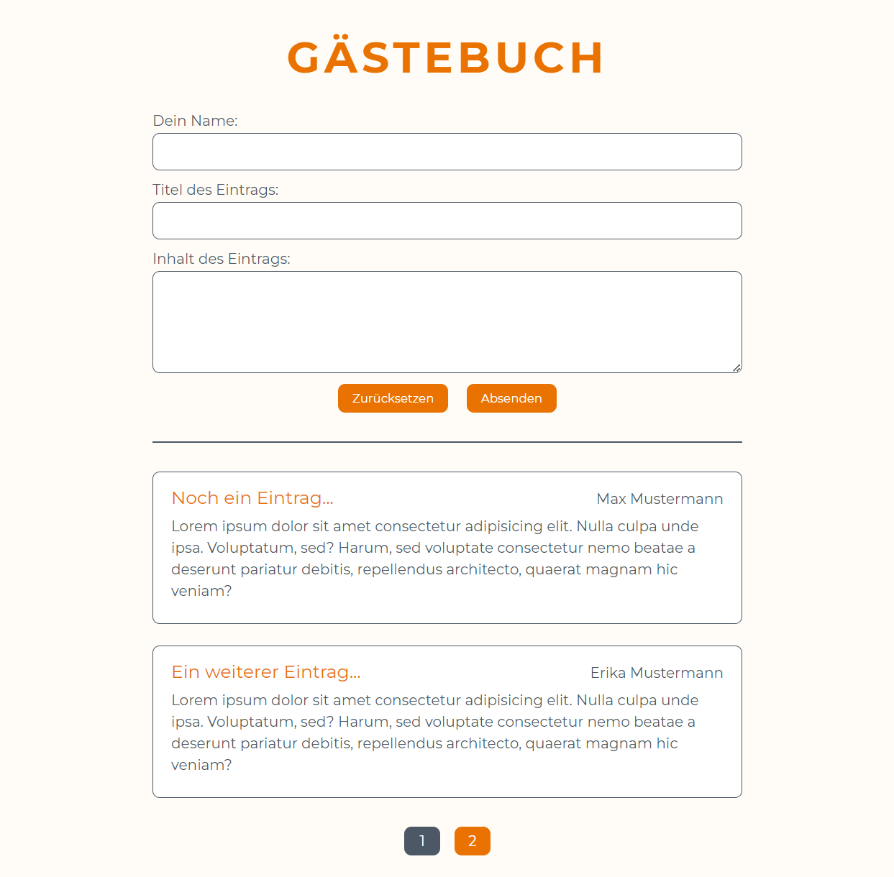

# Gästebuch-Projekt

Mit dem Gästebuch lassen sich Einträge für ein Gästebuch erstellen. Diese müssen einen Namen, einen Titel und eine Beschreibung enthalten.

Unter dem Formular sind alle Einträge nach dem Erstellungsdatum absteigend aufgelistet. Dabei wird bei mehr als einer Seite eine Paginierung angezeigt.

Hier eine Vorschau des Projekts:

Weitere Informationen: Zur Persistierung der Daten wird eine MySQL-Datenbank verwendet (siehe _db-connect.php_).
